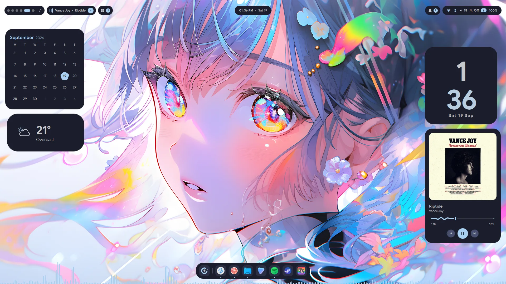
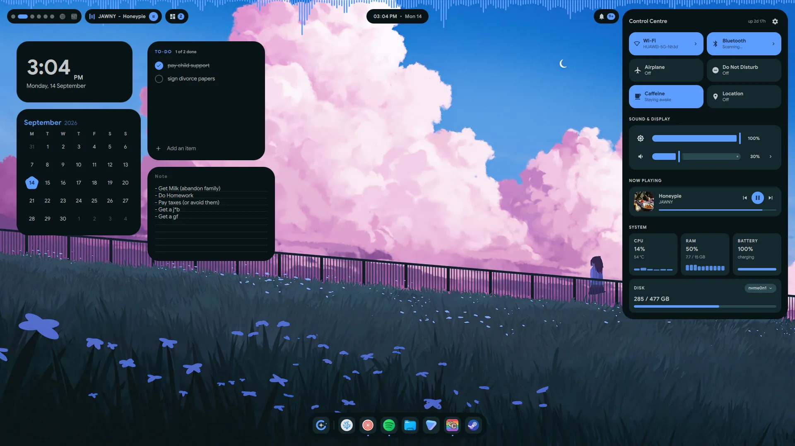
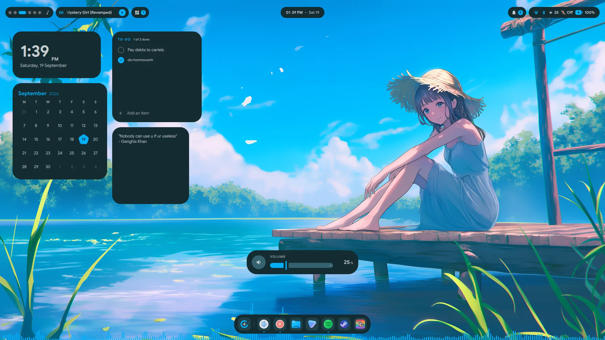
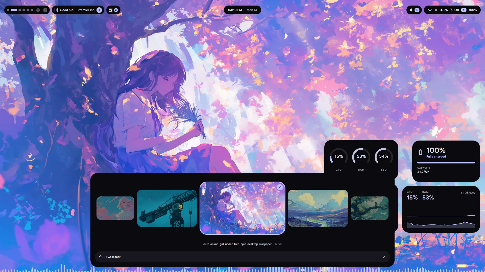
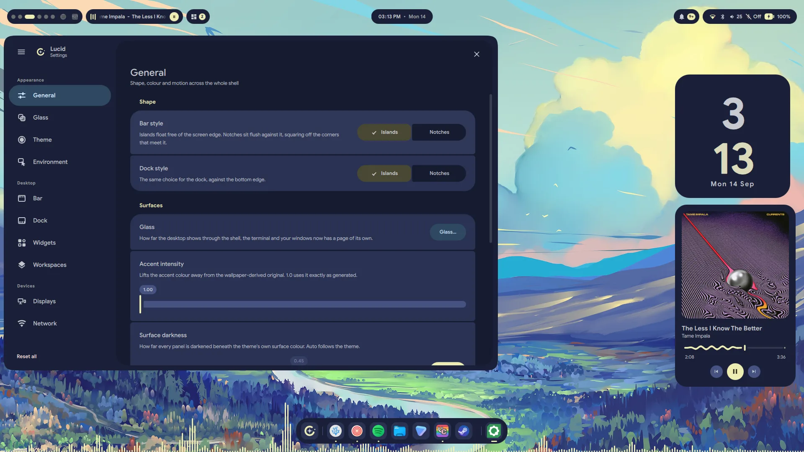

<div align="center">


# Lucid

**A Material 3 Expressive desktop shell for Hyprland, built on [Quickshell](https://quickshell.org).**

A bar, a dock that morphs into a launcher, a lock screen, an emoji picker,
a screenshot tool and a settings app — themed together from your wallpaper.

`v0.57` · beta · Arch Linux + Hyprland · MIT



</div>

---

> **Beta.** This is the first public release. It works, it's what I use daily, but
> expect rough edges and breaking changes between versions. Bug reports welcome.

## Install

Lucid installs to `~/.config/quickshell` and needs **Arch Linux** and
**Hyprland**. Three commands:

```sh
git clone https://github.com/Sn3akyy1/lucid-shell.git
cd lucid-shell
./install.sh
```

That's it — the installer does the rest:

1. **Checks your system** — refuses to run anywhere it can't finish the job,
   rather than leaving you half-installed.
2. **Installs dependencies** — finds `paru` or `yay` and uses it, falling back
   to `pacman` for repo packages. It lists everything and asks before touching
   your system. Say no and it carries on, telling you which features won't work.
3. **Copies the shell** to `~/.config/quickshell`, moving any existing config to
   `~/.config/quickshell.backup-<timestamp>` first.
4. **Sets up theming** — the palettes, the wallpaper hook, and the matugen
   template. An existing `matugen/config.toml` is appended to, never replaced.
5. **Offers to restart** a running instance onto the new files.

Then start it:

```sh
qs
```

To launch it with your session, add to `~/.config/hypr/hyprland.conf`:

```
exec-once = qs
```

Set a wallpaper from **Settings → General** on first run — that's what generates
your colour palette.

### Updating

Pull and re-run. Your settings, pinned apps, reminders, Shazam history and API
keys are carried forward into the new install:

```sh
git pull
./install.sh
```

### Installer options

| Flag | What it does |
| --- | --- |
| `--no-theming` | Shell only. Leaves `~/.config/lucid`, `~/.config/matugen` and `~/.config/hypr` alone. Use this if you already have a matugen setup you don't want touched. |
| `--skip-deps` | Never installs packages, just reports what's missing. |
| `-y`, `--yes` | Accept every prompt. |

Re-running the installer is how you update. It moves your existing
`~/.config/quickshell` to `~/.config/quickshell.backup-<timestamp>`, installs
the new shell files, then carries your settings, pinned apps, reminders,
Shazam history and API keys forward into it. Nothing is deleted, and the
backup stays where it is until you remove it.

## Keybinds

Nothing is bound for you — Lucid exposes everything over IPC so you pick your
own. A reasonable starting set for `hyprland.conf`:

```
bind = SUPER, SPACE,  exec, qs ipc call -- launcher toggle
bind = SUPER, E,      exec, qs ipc call -- moji toggle
bind = SUPER, L,      exec, qs ipc call -- lock lock
bind = SUPER, S,      exec, qs ipc call -- snap toggle
bind = SUPER, comma,  exec, qs ipc call -- settings open
```

Keep the `--`. It is only strictly required when the call takes an argument —
`qs ipc call settings show bar` fails with *"The following argument was not
expected: bar"*, while `qs ipc call -- settings show bar` works. It is harmless
on argument-free calls, so using it everywhere saves you the surprise.

## What's in it

### Bar

Six modules, each a pill that expands into a panel. Every one can be turned
off in Settings.

- **Workspaces** — live window previews per workspace, click to switch
- **Media** — MPRIS controls, seek bar, art, and Shazam-style song ID (`songrec`)
- **Tray** — SNI system tray with working context menus
- **Clock** — calendar, weather, and reminders that toast when they're due
- **Notifications** — arrival toasts, history, do-not-disturb
- **System** — volume, brightness, battery, disk stats, plus full Wi-Fi and
  Bluetooth panels

Two shapes, set in Settings: **island** (floating rounded pills) or **notch**
(flush to the screen edge, with flares that blend into it).



*The System pill opens into a control centre — Wi-Fi and Bluetooth with full
panels behind them, brightness and volume, battery, RAM, CPU and per-disk usage,
with notifications underneath.*



*Media, expanded: album art, a live `cava` visualiser, and a waveform seek bar.*

### Dock and launcher

A floating M3 toolbar that grows into the launcher rather than opening a
second window over it. Pinned apps, running-window indicators, drag to
reorder, optional magnification and auto-hide.

The launcher is one search field over five modes:

| Mode | What it does |
| --- | --- |
| Apps | Fuzzy search over `.desktop` entries — word boundaries and initials both hit, so `vsc` finds Visual Studio Code |
| Commands | Shell commands and shell actions |
| Theme | Switch between the seven bundled palettes |
| Wallpaper | Carousel of your wallpaper folder |
| Power | Lock, log out, suspend, reboot, shut down, hibernate |

Type `=` in the search field for a calculator (`=2^3^2`, right-associative).



*Wallpaper mode: a carousel that previews as you move through it, and applies
on the second press.*

### Everything else

- **Lock screen** — a real `WlSessionLock`, with weather, media controls,
  notifications and system stats on it
- **Emoji picker** — emoji, kaomoji and GIFs (Giphy or Tenor), with recents,
  favourites and skin-tone variants; pastes into the focused window
- **Screenshots** — region select, full screen, and screen recording with
  optional mic and system audio
- **OSD** — volume and brightness overlays
- **Settings** — a GUI for all of the above, no config file editing



*Settings, with a live preview of whatever you are adjusting. Every control
shows a reset arrow once it differs from the default.*

## Theming

Colours come from one of seven palettes, picked in Settings or via the
launcher's Theme mode:

**Matugen** and **Pywal** generate a palette from your current wallpaper.
**Catppuccin Mocha**, **Gruvbox**, **Nightfox**, **Nord** and **Tokyo Night**
are fixed palettes that don't change with the wallpaper.

Whichever is active, the shell reads `~/.cache/quickshell/matugen.json` — a
flat map of Material 3 colour roles. Changing your wallpaper through Lucid
runs `~/.config/hypr/scripts/wallpaper/set-wallpaper.sh`, which sets the
wallpaper and then regenerates that file if the active theme is wallpaper-derived.

If you already use matugen, the installer **appends** its Quickshell template
to your `config.toml` and backs up the original — your existing templates are
left alone.

### Adding your own theme

Drop a palette at `~/.config/lucid/themes/<id>/quickshell.json` using the
same keys as the bundled ones, then add it to `themeCatalogue` in `Prefs.qml`.

## Requirements

Arch Linux and Hyprland. The installer handles all of this, listed here so
you know what's being pulled in.

**Required** — the shell won't start without these:

`quickshell` · `qt6-5compat` · `qt6-declarative` · `qt6-multimedia`

**Per feature** — a missing one breaks only its own feature:

| Package | Backs |
| --- | --- |
| `matugen`, `jq` | Wallpaper-derived colours, theme switching |
| `awww` (AUR) | Setting the wallpaper |
| `python-pywal` | The Pywal theme |
| `networkmanager` | Wi-Fi panel |
| `bluez`, `bluez-utils` | Bluetooth panel |
| `libpulse`, `wireplumber` | Volume, audio devices |
| `brightnessctl`, `upower` | Brightness, battery |
| `grim`, `wf-recorder`, `ffmpeg`, `imagemagick` | Screenshots and recording |
| `wl-clipboard`, `wtype` | Emoji and GIF pasting |
| `cava` | Audio visualiser in the media panel |
| `songrec` | Song identification |
| `curl` | Weather and GIF search |
| `libnotify` | Notification actions |
| `ttf-noto-color-emoji` | Emoji rendering |

Lucid uses Hyprland-specific APIs for workspaces and window management. It
will not work on other compositors.

### Fonts

The default UI font is **Google Sans**, which is not in the Arch repos. If you
don't have it, Qt falls back to your default sans and everything still works —
or pick any installed font in Settings → General.

## Optional setup

**GIF search** needs a free Giphy key (email only, no card) from
[developers.giphy.com](https://developers.giphy.com/dashboard/). Put it in
`~/.config/quickshell/lucidmoji/config.json`:

```json
{ "giphyKey": "your-key-here", "tenorKey": "", "gifDir": "" }
```

Tenor works too if you'd rather use that. Emoji and kaomoji need no key.

**Wallpapers** default to `~/Pictures/wallpapers`. Change the folder in
Settings → General.

## IPC reference

Every surface is scriptable. `qs ipc call -- <target> <function> [arg]`:

| Target | Functions |
| --- | --- |
| `launcher` | `toggle` `open` `close` `wallpaper` `theme` `power` `blur` `command` `shuffle` `search <query>` |
| `settings` | `toggle` `open` `close` `show <page>` `general` `bar` `dock` `font` `reset` |
| `moji` | `toggle` `open` `close` `emoji` `kaomoji` `gif` `center` |
| `lock` | `lock` `unlock` `isLocked` |
| `snap` | `toggle` `open` `close` |
| `screenshot` | `full` |
| `media` | `toggle` `open` `close` `identify` `playPause` `next` `previous` |
| `workspaces` | `toggle` `open` `close` |
| `debug` | `toggle` `on` `off` — draws input and blur region outlines |

## Uninstall

```sh
./uninstall.sh
```

Moves `~/.config/quickshell` aside rather than deleting it, so your settings
survive. Packages installed by `install.sh` are left alone.

## Troubleshooting

**Nothing appears when I run `qs`.** Check `qs log` for QML errors, and
confirm you're on Hyprland — Lucid needs its Wayland protocols.

**Everything is grey / colours look wrong.** The palette cache is missing or
empty. Set a wallpaper through Settings → General, or copy a bundled palette:
`cp ~/.config/lucid/themes/nord/quickshell.json ~/.cache/quickshell/matugen.json`

**The blur frosts my windows instead of the desktop.** Hyprland's blur samples
whatever is behind the layer. Add to `hyprland.conf`:

```
layerrule = xray 1, quickshell
```

**Icons look blurry.** A fractional `monitor` scale factor puts icons on
fractional pixels. Use an integer scale, or adjust the icon size in Settings.

**A keybind with an argument does nothing.** Add `--` before the target:
`qs ipc call -- settings show bar`. Without it `qs` parses the argument as its
own and refuses the call. Argument-free calls work either way.

## Contributing

Issues and PRs welcome. If you're reporting a bug, `qs log` output and your
Hyprland version help a lot.

## The mark


The logo is **Lucida** — the astronomical term for the brightest star in a
constellation, sharing its Latin root (*lux*) with "Lucid". A broken orbit ring,
a four-point star at the centre, and one companion dot outside the gap.

Its official colour is **coral `#FF7F50`**. In the shell itself the ring and the
companion dot track your accent, so the mark on the dock launcher recolours with
whatever palette you are running — but coral is the canonical brand colour, and
what you see above.

<br clear="left">

`assets/logo.svg` is the mark on its dark plate; `assets/logo-mark.svg` is the
bare coral mark for light and dark backgrounds alike. Both are drawn from the
same 24×24 geometry as [`LucidaMark.qml`](lucidprefs/LucidaMark.qml).

## License

MIT — see [LICENSE](LICENSE).

Built on [Quickshell](https://quickshell.org). Colour generation by
[matugen](https://github.com/InioX/matugen). Design follows
[Material 3 Expressive](https://m3.material.io).
